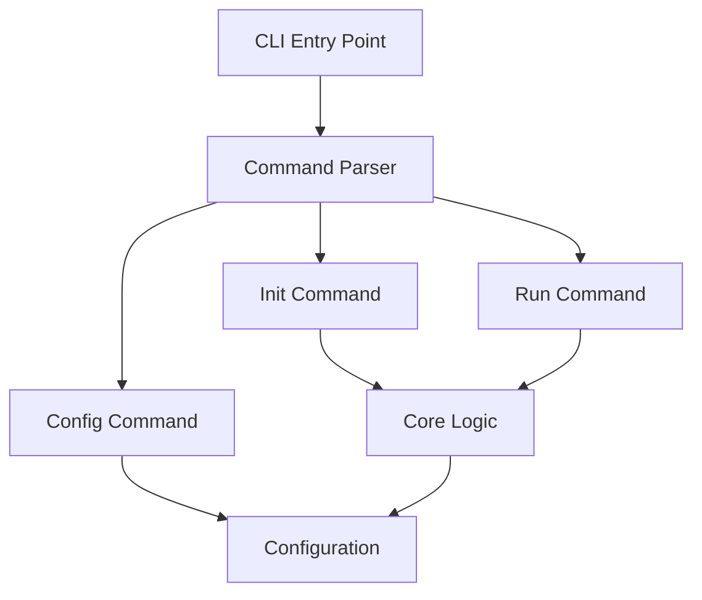
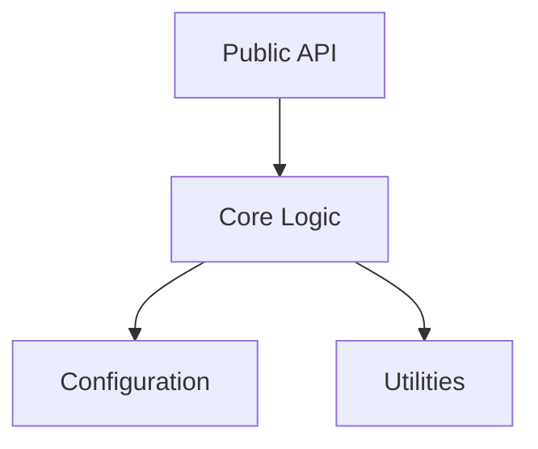
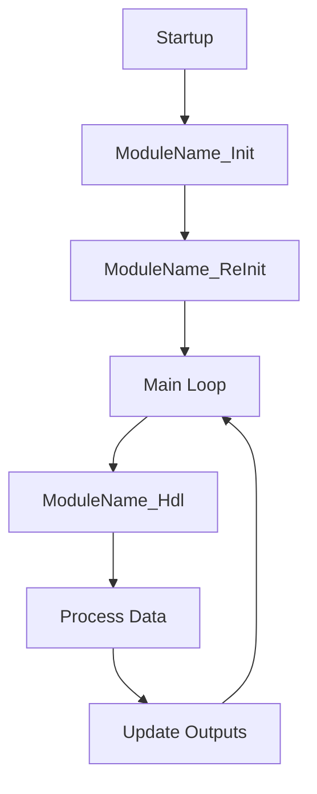

# Architecture

## Overview


{{ cookiecutter.project_name }} follows a modular CLI architecture:

## Components

### CLI Layer
- Argument parsing with argparse
- Command routing
- Error handling

### Core Layer
- Business logic
- Data processing

### Configuration Layer
- Environment variable loading (.env, .env-private)
- Config file support (YAML, JSON, TOML)
- Priority-based configuration


{{ cookiecutter.project_name }} follows a layered library architecture:


{{ cookiecutter.project_name }} follows a cyclic handler pattern for embedded systems:

## Components

### Cyclic Handler
- `ModuleName_Init`: One-time initialization
- `ModuleName_ReInit`: Re-initialization
- `ModuleName_Hdl`: Cyclic handler called every cycle

### Hardware Abstraction
- GPIO interface
- Memory-mapped I/O



## Design Decisions

See [Architecture Decision Records](decisions/) for detailed design decisions.
